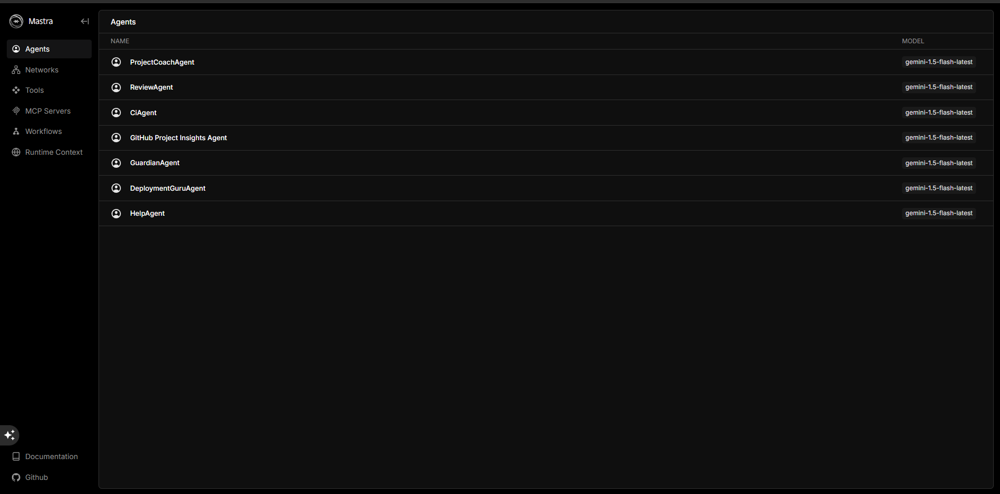
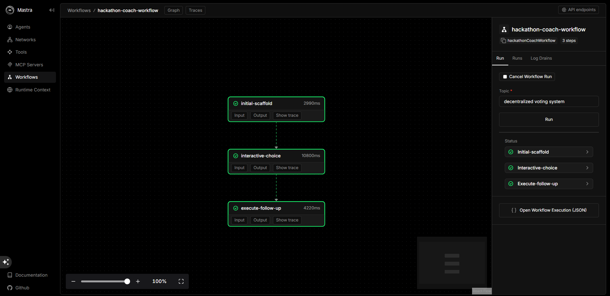

# 🧠 Hackathon Coach: Your AI-Powered Co-Pilot for Instant Project Scaffolding






<p align="center">


</p>

Hackathon Coach is a sophisticated, multi-agent AI system designed to eliminate the friction of starting a new software project. It acts as an intelligent co-pilot, guiding a developer from a vague topic to a fully scaffolded, secure, and deployment-ready GitHub repository in minutes.

🏆 Submission for the Nosana Agent Challenge: Agent-101

Video Demo: [LINK TO YOUR 1-3 MINUTE VIDEO DEMO HERE]

Docker Hub Container: [LINK TO YOUR PUBLIC DOCKER HUB REPOSITORY HERE] (e.g., https://hub.docker.com/r/sahilahmed21/hackathon-coach)

Nosana Deployment: [LINK TO YOUR NOSANA JOB DASHBOARD OR JOB ID HERE]

🎯 The Problem it Solves

Every developer knows the initial inertia of starting a new project: brainstorming a viable idea, creating a project plan, setting up the repository, creating boilerplate files, and configuring CI/CD. This repetitive setup can take hours and stifles creative momentum. Hackathon Coach automates this entire process, allowing developers to focus on what truly matters: building innovative features.

✨ Key Features

🚀 Full-Cycle Project Generation: Go from a single topic like "AI recipe app" to a complete, initialized GitHub repository in one command.

🧠 A Suite of Specialized AI Agents: Features a team of eight distinct agents, each an expert in its domain (planning, security, deployment, code review, etc.).

⚙️ Interactive & Stateful Workflow: An intelligent workflow orchestrates the agents, pausing for user input to create a dynamic and guided experience.

💾 Long-Term Project Memory: A stateful ProjectTrackerAgent saves the details of every project you create to a local database, allowing you to list and manage your work over time.

🛡️ Robust Dual-LLM Fallback System: Intelligently uses Google Gemini as the primary LLM and can automatically fall back to a self-hosted Ollama instance if the primary service fails, ensuring high availability.

🔧 Professional Architecture: Built on a clean, scalable Agents -> Tools -> Services pattern for easy maintenance and extension.

🛠️ How It Works: Architecture Overview

The project is built on a professional, modular architecture that separates concerns, making it robust and easy to understand.

File Structure
```
src/mastra/
├── agents/              # Defines the "personality" and goals of each agent.
│   ├── ProjectCoachAgent.ts
│   ├── GuardianAgent.ts
│   ├── DeploymentGuruAgent.ts
│   ├── ... (and 5 others)
├── services/            # Contains all the complex, reusable business logic (e.g., GitHub API calls).
│   ├── githubService.ts
│   ├── projectDBService.ts
│   └── ...
├── tools/               # The "bridge" between agents and services, defining capabilities.
│   ├── github/
│   ├── analysis/
│   └── ...
├── workflows/           # Orchestrates multiple agents to perform complex, multi-step tasks.
│   └── coach-workflow.ts
├── config.ts            # Central configuration, featuring the dual-LLM fallback logic.
└── index.ts             # Main Mastra registration for all components.
```

The Agent Roster

Our coach is a team of specialists:

ProjectCoachAgent: The team lead. Brainstorms ideas, creates plans, and scaffolds the initial empty repository.

GuardianAgent: The security officer. Scans project dependencies for vulnerabilities.

DeploymentGuruAgent: The DevOps engineer. Adds Dockerfile, .nosana-ci.yml, and other deployment configurations.

ReviewAgent: The senior developer. Conducts qualitative code reviews on pull requests.

CiAgent: The build monitor. Checks and reports the status of GitHub Actions.

GitHub Project Insights Agent: The analyst. Gathers repository statistics and finds "good first issues."

HelpAgent: The "Stuck?" support. Finds documentation and tutorials for developer problems.

ProjectTrackerAgent: The archivist. Provides long-term memory by saving and listing project details from a local JSON database.

🚀 Getting Started

Follow these steps to run the Hackathon Coach locally.

Prerequisites

Node.js (v20.x or later)

pnpm

Git

A GitHub account and a Personal Access Token with repo permissions.

1. Clone the Repository
```bash
git clone [YOUR_FORKED_REPOSITORY_URL]
cd hackathon-coach
```
2. Install Dependencies
```bash
pnpm install
```
3. Configure Your Environment

Create a .env file in the root of the project by copying the .env.example file. Then, fill in your own credentials.

```dotenv
# .env

# --- Google Gemini Configuration ---
GOOGLE_GENERATIVE_AI_API_KEY=AIzaSy...
GEMINI_MODEL_NAME=gemini-1.5-flash-latest

# --- (Optional) Ollama Fallback Configuration ---
API_BASE_URL=http://127.0.0.1:11434
MODEL_NAME_AT_ENDPOINT=qwen2.5:7b

# --- Fallback Configuration ---
# Set the primary provider. Can be "google" or "ollama".
PRIMARY_PROVIDER=google

# --- GitHub Configuration ---
GITHUB_TOKEN=ghp_...
GITHUB_USERNAME=your-github-username
```
4. Run the Development Server
```bash
pnpm run dev
```

This will start the Mastra server. You can access the Playground at http://localhost:4111 to test individual agents.

💡 How to Use: Prompts & Expected Outputs

You can interact with the system in two ways: testing individual agents or running the main end-to-end workflow.

Testing Individual Agents (via Playground)

Navigate to http://localhost:4111 to test the specialists.

Example 1: HelpAgent

Agent to Select: HelpAgent

Prompt:
```
How do I fix a CORS error in my Express.js app?
```

Expected Output:

I found a few resources that might help you with that CORS error. It usually means your server isn't sending the right headers.

MDN Web Docs: Cross-Origin Resource Sharing (CORS)

The official documentation is the best place to understand the problem. You likely need to use a middleware library.

Stack Overflow: Express CORS Middleware

Search for solutions on Stack Overflow. The most common solution is to use the cors npm package.

Example 2: ProjectTrackerAgent

Agent to Select: ProjectTrackerAgent

Prompt:
```
List my saved projects
```

Expected Output: (After running the main workflow at least once)

Here are your saved projects:

Name	Framework	GitHub URL
ai-recipe-advisor	nextjs	https://github.com/sahilahmed21/ai-recipe-advisor
Testing the Main Workflow (via CLI)

This is the main event. The workflow orchestrates multiple agents to perform the full project setup.

Instructions:

Keep your development server running in one terminal.

Open a new terminal window.

Run the following command:

```bash
pnpm mastra workflow run hackathon-coach-workflow --input='{ "topic": "A personal finance dashboard" }'
```

Expected Interaction in your Terminal:
The workflow will execute step-by-step, providing real-time feedback and pausing for your input.

```console
🤖 CoachAgent: Generating idea and scaffolding project for topic: "A personal finance dashboard"...
✅ Repo created: https://github.com/sahilahmed21/personal-finance-dashboard
🌱 Initializing repository with a README.md file...
✅ Repository initialized successfully.

🤔 What would you like to do next?
1. Scan for security issues
2. Set up deployment files
Enter choice (1 or 2): 2

🚀 DeploymentGuru: Scaffolding deployment files...
✅ Task "deployment" completed.
💾 ProjectTrackerAgent: Saving project details to database...
🎉 All done! Your project "personal-finance-dashboard" has been fully scaffolded and saved.
```

🐳 Docker & Deployment

Instructions for building and running the project as a Docker container, ready for deployment on Nosana.

Build the Container
```bash
docker build -t sahilahmed21/hackathon-coach:latest .
```
Run the Container Locally
```bash
docker run -p 8080:8080 --env-file .env sahilahmed21/hackathon-coach:latest
```
Push to Docker Hub
```bash
docker login
docker push sahilahmed21/hackathon-coach:latest
```

---

## 🔮 Future Plans

- Add more framework templates (React, Django, etc.)
- Integrate with other CI/CD platforms (CircleCI, Netlify)
- Enhance HelpAgent with Stack Overflow API integration
- Develop a GitHub analytics visualizer

---

## 📝 License

This project is licensed under the MIT License - see the [LICENSE](LICENSE) file for details.

---

## 🙏 Acknowledgments

- [Mastra Framework](https://github.com/mastra-ai/mastra)
- Nosana Agent Challenge
- Google Gemini & Ollama
- Visual Studio Code
